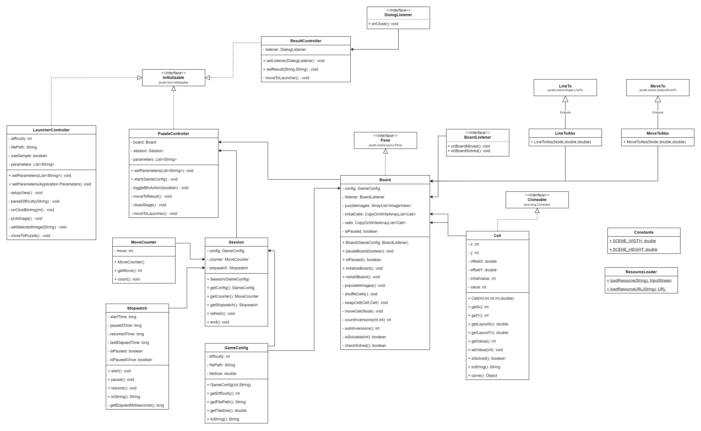

# 15 Puzzle

This repository is a final project (Java GUI) from Object-Oriented Programming Class, Teknik Informatika Universitas Padjadjaran.

[Challenge Guidelines](challenge-guideline.md)

## Deskripsi Project

15 Puzzle adalah sebuah game sliding puzzle yang terdiri dari beberapa tile bernomor yang tersusun secara acak. Terdapat 1 tile yang hilang sebagai space untuk menggeser tiles bernomor. Game ini bertujuan untuk menyusun tile bernomor acak menjadi berurutan.

Ukuran puzzle ini 4x4 dengan 1 tile kosong sehingga berjumlah 15 sehingga disebut 15 Puzzle. Selain itu ada variasi lain seperti 8 Puzzle yang merupakan versi 3x3 dari 15 Puzzle.


## Credits

| NPM          | Name                       |
| ------------ | -------------------------- |
| 140810200001 | Ariq Hakim Ruswadi         |
| 140810200041 | Alvaro Dwi Oktaviano       |
| 140810200049 | Rafiansyah Rasyid Wikawang |

## Change log

- **[Sprint Planning](changelog/sprint-planning.md) - (20/11/2021)**

  - Inisialisasi projek gradle

- **[Sprint 1](changelog/sprint-1.md) - (20/11/2021 - 22/11/2021)**

  - N/A

- **[Sprint 2](changelog/sprint-2.md) - (24/11/2021 - 29/11/2021)**

  - Implementasi FXML untuk Launcher dan Puzzle
  - Implementasi Board dan Cell (untuk slider puzzle)
  - Implementasi GameConfig dan Session (untuk menyimpan data permainan)
  - Implementasi Stopwatch
  - Implementasi MoveCounter
  - Implementasi algoritma pengecekan isSolvable() pada puzzle
  - Implementasi shuffling dan reset button
  - Implementasi komponen pada Launcher (combobox dan image picker)
  - Implementasi custom image loader pada puzzle
  - Implementasi transfer data dari Launcher ke Puzzle
  - Implementasi fitur reset puzzle
  - Implementasi fitur refresh puzzle
  - Implementasi fitur pause dan resume puzzle

- **[Sprint 3](changelog/sprint-3.md) - (1/12/2021 - 6/12/2021)**

  - Implementasi running aplikasi dengan args
  - Implementasi FXML untuk Result
  - Menghubungkan Puzzle ke Result
  - Menghubungkan Result ke Launcher
  - Bugfix shuffling puzzle
  - Generate JAR

## Running The App

Aplikasi kami dapat dijalankan dengan 2 cara :

### Clone dan build sendiri

Cara ini membutuhkan repository ini di clone di local environment serta pastikan Java dan JavaFX versi > 16 telah dipasang.

Untuk menjalankan aplikasi, tinggal jalankan ini di root folder project hasil clone.

```bash
gradlew run
```

### Menggunakan JAR

Cara ini memerlukan JAR, seperti yang ada di [Release](https://github.com/praktikum-tiunpad-2021/oop-final-kelompok-a-07/releases/tag/1.0.0)

Selain itu, JAR juga bisa dibuat menggunakan
```bash
gradlew shadowJar
```

Kemudian jalankan file JAR dengan

```bash
java -jar _15Puzzle.jar
```

---
Aplikasi ini juga dapat dijalankan dengan arguments, lebih jelasnya lihat [Notable Assumption and Design App Details](#args)

## Classes Used

Kami menggunakan package terpisah untuk memudahkan pengembangan aplikasi.
Ada 4 package utama, yaitu :

### 1. **controller**

Berisi controller yang dihubungkan ke tampilan fxml UI.Kami menggunakan arsitektur MVC dengan mengikuti guidelines dari javaFX.

- 1.1 **LauncherController** - [`LauncherController.java`](src/main/java/team/emergence/_15puzzle/controller/LauncherController.java)

  Controller untuk window Launcher, berisi kode untuk memilih konfigurasi game puzzle seperti memilih _difficulty_ serta gambar yang akan dimainkan.

- 1.2 **PuzzleController** - [`PuzzleController.java`](src/main/java/team/emergence/_15puzzle/controller/PuzzleController.java)

  Controller untuk window Puzzle, berisi kode untuk game puzzle.

- 1.3 **ResultController** - [`ResultController.java`](src/main/java/team/emergence/_15puzzle/controller/ResultController.java)

  Controller untuk dialog Result, berisi kode untuk menampilkan hasil serta kembali ke Launcher.

### 2. **core**

Berisi komponen logika yang dipakai dalam puzzle.

- 2.1. **Board** - [`Board.java`](src/main/java/team/emergence/_15puzzle/core/Board.java)

  Komponen dasar untuk game slider, didalamnya ada logika untuk mengecek apakah puzzle bisa diselesaikan, apakah puzzle bisa diklik dan apakah puzzle telah terselesaikan.

- 2.2. **BoardListener** - [`BoardListener.java`](src/main/java/team/emergence/_15puzzle/core/BoardListener.java)

  Interface yang digunakan board untuk menjalankan kode dari luar Board. Di dalamnya diimplementasi dua state, yaitu onBoardClicked (dijalankan saat elemen puzzle diklik) serta onBoardSolved (dijalankan saat puzzle telah terselesaikan)

- 2.3. **DialogListener** - [`BoardListener.java`](src/main/java/team/emergence/_15puzzle/core/DialogListener.java)

  Interface yang digunakan dialog untuk menjalankan kode dari luar classnya. Di dalamnya ada implementasi onClose().

- 2.4. **MoveCounter** - [`MoveCounter.java`](src/main/java/team/emergence/_15puzzle/core/MoveCounter.java)

  Komponen yang digunakan untuk menghitung banyak gerakan dalam puzzle. Berisi logika untuk menghitung move saat pengguna mengerakkan puzzle.

- 2.5. **Stopwatch** - [`Stopwatch.java`](src/main/java/team/emergence/_15puzzle/core/Stopwatch.java)

  Komponen yang digunakan untuk mengitung waktu lamanya puzzle berjalan. Berisi logika untuk start, pause, resume, dan stop.

### 3. **model**

Berisi class untuk menyimpan data dalam aplikasi

- 3.1. **Cell** - [`Cell.java`](src/main/java/team/emergence/_15puzzle/model/Cell.java)

  Komponen model untuk game slider, didalamnya berisi koordinat dari kepingan puzzle yang bisa digeser serta data posisi asli dari kepingan tersebut.

- 3.2. **GameConfig** - [`GameConfig.java`](src/main/java/team/emergence/_15puzzle/model/GameConfig.java)

  Model untuk menyimpan konfigurasi dari game, berisi difficulty serta path untuk image yang dipakai. Model ini yang dioper dari Launcher ke dalam Puzzle serta disimpan dalam Session.

- 3.3. **Session** - [`Session.java`](src/main/java/team/emergence/_15puzzle/model/Session.java)

  Model untuk menyimpan data saat puzzle berjalan, berisi MoveCounter, Stopwatch, dam GameConfig yang digunakan untuk menjalankan puzzle.


### 4. **util**

Berisi class untuk menyimpan data dalam aplikasi

- 4.1. **Constants** - [`Constants.java`](src/main/java/team/emergence/_15puzzle/util/Constants.java)

  Class static untuk menyimpan data konstan, dalam aplikasi kami hanya berisi SCENE_WIDTH dan SCENE_HEIGHT.

- 4.2. **ResourceLoader** - [`ResourceLoader.java`](src/main/java/team/emergence/_15puzzle/util/ResourceLoader.java)

  Class static untuk membantu loading resource menggunakan getClassPath().getResource().

- 4.3. **LineToAbs** - [`animation/LineToAbs.java`](src/main/java/team/emergence/_15puzzle/util/animation/LineToAbs.java)

  Implementasi dari class LineTo JavaFX, dipakai untuk menggambar Line Path; bagian dari animasi menggunakan PathTransition.

- 3.4. **MoveToAbs** - [`animation/MoveToAbs.java`](src/main/java/team/emergence/_15puzzle/util/animation/MoveToAbs.java)

  Implementasi dari class MoveTo JavaFX, dipakai untuk menggerakan elemen yang telah memiliki Line Path; bagian dari animasi menggunakan PathTransition.

### Komponen lain

- 5.1. **App** - [`App.java`](src/main/java/team/emergence/_15puzzle/App.java)

  Class main, implementasi javafx.Application. Digunakan untuk memanggil Launcher

- 5.2. **Launcher.fxml** - [`Launcher.fxml`](src/main/resources/team/emergence/_15puzzle/fxml/Launcher.fxml)

  UI dari Launcher, dibuat menggunakan Gluon Scene Builder.

- 5.3. **Puzzle.fxml** - [`Puzzle.fxml`](src/main/resources/team/emergence/_15puzzle/fxml/Puzzle.fxml)

  UI dari Puzzle, dibuat menggunakan Gluon Scene Builder.

---


## Notable Assumption and Design App Details

### Desain Aplikasi
- Ada 2 window dalam aplikasi ini, yaitu Launcher dan Puzzle
  - Window Launcher berisi konfigurasi game yaitu memilih tingkat kesulitan atau jumlah grid serta memilih gambar yang akan dimainkan
  - Window Puzzle berisi tampilan Puzzle
- Selain itu, ada juga dialog Result yang muncul setelah puzzle berhasil diselesaikan.
- Resolusi PuzzleGrid paling optimal untuk penggunaan 2 argumen adalah 1280x720.
- Rekomendasi kesulitan game adalah 3x3, 4x4, dan 5x5.

### Args
- Aplikasi ini akan membaca 2 args
  - args pertama berupa int untuk n ukuran puzzle dengan ketentuan (2 >= n <= 10)
  - args kedua berupa string untuk filepath gambar custom yang akan dipakai
    - dapat berupa full path ke gambar (eg. "C:\Users\varoa\Downloads\image\blahaj.jpeg")
    - dapat berupa teks "sample1", "sample2", "sample3" (untuk mengakses sample image)

**Contoh Pemakaian**

(untuk puzzle 6x6 dengan gambar default sample3

**Gradle**
```bash
gradlew run --args='6 "sample3"'
```
**JAR**
```bash
java -jar _15puzzle.jar 6 "sample3"
```

### Fitur Aplikasi
- Gambar preset disediakan 3 jenis gambar tetapi user bisa memasukkan gambar custom secara manual dengan memilih 'Import Image'.
  - Gambar custom akan di stretch untuk dijadikan bentuk persegi.
- Game memiliki fitur **move counter** dan **timer**.
- Ketika puzzle dimainkan, akan ada **example** yang merupakan hasil akhir ketika puzzle tersusun dengan rapih.
- Jika ingin mengganti mode, user tinggal menekan tombol **Back to Menu** dan memilih kembali mode yang ingin dimainkan.
- Terdapat tombol **Reset** yang dapat digunakan untuk mengulang puzzle yang sama.
- Terdapat tombol **Refresh** yang dapat digunakan untuk mengacak puzzle.
- Terdapat tombol **Pause** yang dapat digunakan untuk menghentikan puzzle sementara. Saat di *pause*, player tidak bisa menggerakan puzzle dan timer berhenti sementara.
